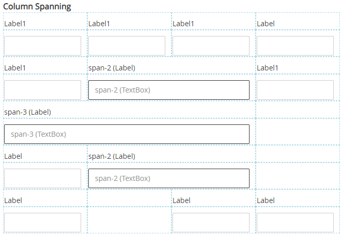

# Layout Grid Column Span

Sometimes we want to make one grid cell span scross multiple columns in our *Layout Grid*. This is not a native feature of the *Layout Grid* control, but this module makes it possible to accomplish it. 



## Version
Initial 1.0

# Setup

## Application Setup
1. Check the *Enable Style Sheet* checkbox in the application properties

## Global Script
1. Create a Global Script called "ScriptName"
2. Add the input parameters below to the Global Script
3. Drag a *JavaScript* action into the script
4. Add the Javascript below into the JavaScript code property
```javascript
/* Stadium Script v1.0 https://github.com/stadium-software/layout-grid-column-span */
let allGrids = document.querySelectorAll(".grid-layout:has([class*=span-])");
for (let j = 0; j < allGrids.length; j++) {
    let colCount = getCellsPerRow(allGrids[j]);
    let allFields = allGrids[j].querySelectorAll(".grid-item");
    let pos = 0;
    let hide = false;
    let spanCols = 0;
    for (let i = 0; i < allFields.length; i++) {
        pos++;
        let span;
        if (allFields[i].querySelector("[class*=span-]")) {
            let classes = allFields[i].querySelector("[class*=span-]").getAttribute("class").split(" ");
            span = classes.filter(getClass);
            spanCols = parseInt(span[0].replace("span-", ""));
            allFields[i].style.gridColumn = pos + "/" + (pos + spanCols);
        }
        if (span) {
            hide = true;
        } else if (hide) {
            allFields[i].style.display = "none";
            spanCols -= 1;
            if (spanCols == 1) {
                hide = false;
            }
        }
        if (pos == colCount) {
            pos = 0;
            hide = false;
        }
    }
}
function getCellsPerRow(grd) {
    let cssObj = window.getComputedStyle(grd, null);
    let gridTemplateColumns = cssObj.getPropertyValue("grid-template-columns");
    return gridTemplateColumns.split("[col-start]").length - 1;
}
function getClass(cl) {
    return cl.startsWith("span-");
}
```

## Page
1. Drag a *Layout Grid* control to a page
2. Drag other controls into the *Layout Grid*
3. For controls inside cells that should span multiple columns, add the class span-# (# is the number of columns to span) into the control classes property

**Examples**
1. span-2: Adding this class causes the control to span across 2 columns
2. span-3: Adding this class causes the control to span across 3 columns

## Notes
1. Spanned columns will not be visible in the rendered page
2. Control content will not automatically stretch to fit the cell width. This may require additional CSS

**Example CSS for stretching TextBoxes (input tags) to fit the cell**
```css
/* CSS selects all controls that have span tags */
/* and makes textbox and dropdown controls stretch to fill the available space*/
[class*="span-"] {
    display: flex;
    input[type='text'], 
    textarea,
    select {
        flex: 1;
    }
    > div:has(select) {
        flex: 1;
        display: flex;
    }
}
```

## Working with Stadium Repos
Stadium Repos are not static. They change as additional features are added and bugs are fixed. Using the right method to work with Stadium Repos allows for upgrading them in a controlled manner. How to use and update application repos is described here 

[Working with Stadium Repos](https://github.com/stadium-software/samples-upgrading)